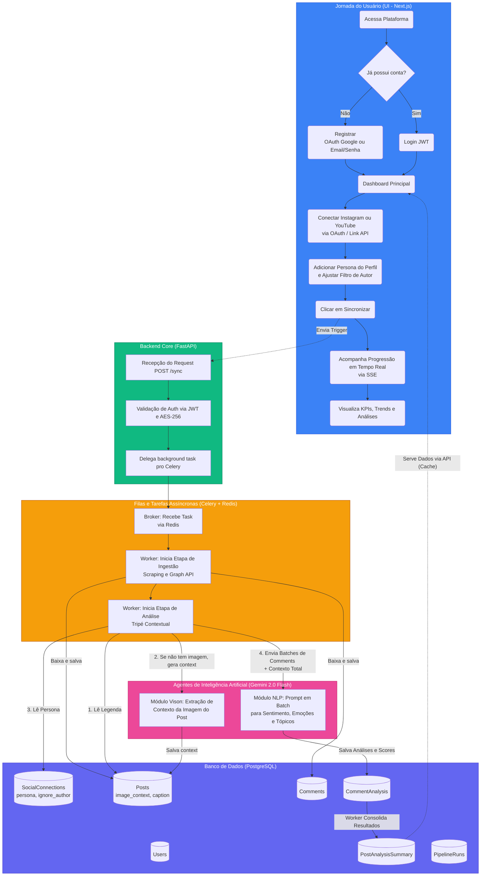

# Sentimenta - Arquitetura de Fluxo e Banco de Dados (Atualizado)

## 1. Diagrama de Fluxo Mermaid (Macro e Funcional)
*Copie e cole no [Mermaid Live](https://mermaid.live/) ou em plugins do Figma para visualização.*

## 2. Mega Prompt Detalhado para o Miro AI (Criação de Arquitetura de Nuvem e Banco)

Copie o texto abaixo exatamente como está e cole na IA do Miro (Miro Assist) ou ferramentas semelhantes para que ele desenhe tanto sua arquitetura de infraestrutura quanto as cardinalidades do banco e o fluxo lógico do seu negócio.

***

**[Copie a partir daqui até o fim do documento]**

Atue como o Arquiteto Soluções Chefe da plataforma "Sentimenta". Quero que você desenhe um framework visual hiper-detalhado (Flowchart e Entity-Relationship Diagram). 

Abaixo está o descritivo de negócios, tecnológico e de infraestrutura do sistema. Com base nele, quero os seguintes diagramas desenhados na minha lousa:
1. Um mapa mental do **Fluxo do Usuário e API (Service Blueprint)**.
2. O desenho do nosso **Modelo de Entidade-Relacionamento do Banco de Dados (Tabelas e Lógicas)**.

### CONTEXTO DA PLATAFORMA (SENTIMENTA)
**Conceito de Negócio:**
Foco em pessoa física (influenciadores, políticos, profissionais). Entrega visibilidade de reputação digital e insights acionáveis a partir de comentários, sem complexidade de ferramentas enterprise.

**Arquitetura e Stack:**
- **Frontend:** Next.js 14, TailwindCSS (Dark/Light mode), Recharts para Dashboards.
- **Backend:** Python, FastAPI, SQLAlchemy, Alembic.
- **Autorização:** JWT (email+senha e access 30 min / refresh 7 dias), Google OAuth Login. Tokens externos de redes sociais são armazenados e criptografados localmente com Fernet (AES-256).
- **Infraestrutura Local/Produção:** PostgreSQL 16, Redis 7 (broker), Worker Celery. Roda no Docker Compose.
- **Integração de Extração:** Instagram Graph API, YouTube (via yt-dlp).
- **Inteligência Artificial (LLM):** Google Gemini 2.0 Flash (usando Visão Computacional de imagem e NLP para textos).

### O MODELO DO BANCO DE DADOS (PostgreSQL)
A relação de cardinalidade tem as seguintes entidades principais:
- **users:** Dados de autenticação, senha criptografada via bcrypt.
- **social_connections:** Perfis monitorados. *Importante:* Possui campos `persona` (texto para dar contexto de nicho para a IA) e `ignore_author_comments` (boolean para evitar inflar o score do dono do canal).
- **posts:** As publicações. *Importante:* Armazena a legenda (`content_text`) e o contexto gerado por IA da imagem da publicação em texto (`image_context`).
- **comments:** Comentários raw (`text_clean`, dados do autor).
- **comment_analysis:** A entidade gerada pelo Gemini, engavetando: `score_0_10`, `polarity`, `intensity`, listas de `emotions`, listas de `topics`, `sarcasm` (booleano) e proxy de `summary_pt`. 
- **post_analysis_summary:** Visão sumarizada/agregada pré-calculada por Post.
- **pipeline_runs:** Histórico da esteira de Celery e log de erros.

### O FLUXO DE COMPUTAÇÃO ASSÍNCRONA (A Mágica)
Quando o usuário pede uma sincronização no Front, a esteira entra na Fila (Redis/Celery) no Backend e segue dois caminhos sequenciais:
1. **Etapa de Ingestão:** Extrai do Youtube ou Insta (de acordo com os filtros de Max Posts) e grava os raw comments no Banco.
2. **Etapa Visão (LLM Visual):** O worker investiga o Post. Se for imagem e não tiver `image_context` gerado no sistema, ele puxa o JPG e manda pro Gemini Vision "descrever a intenção da foto" em 2 linhas. E salva.
3. **Etapa Semântica (LLM NLP - O Tripé Contextual):** O Worker constrói um mega prompt. Ele junta: (1) O texto da `persona`, (2) O texto final gerado do `image_context` e (3) A própria legenda do Post. Baseado no tripé, ele quebra os comentários pendentes em Batches de 30 mensagens soltas e a IA NLP devolve notas, tópicos e sentimentos num array JSON puro. E Grava na tabela analysis.

Use todas essas informações de tabelas, integrações, ferramentas (Docker, Next, FastAPI, Gemini, Celery, Redis) e endpoints de segurança para pintar um diagrama de sistema extremamente moderno, completo, visual e interligado, perfeito para apresentação C-Level e Dev Docs.

**[Fim da Cópia]**
