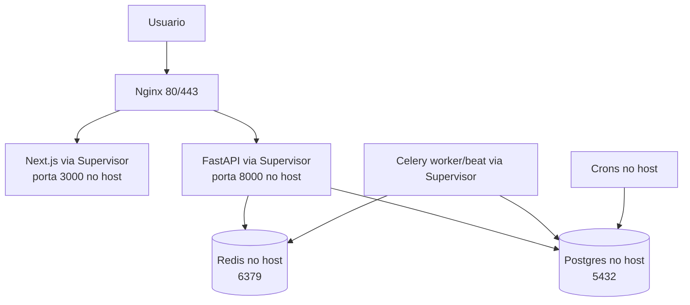
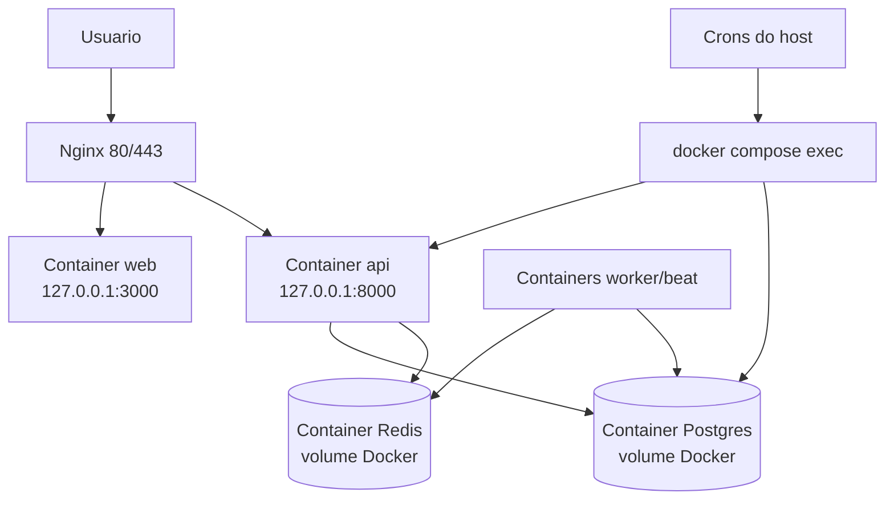

# Sentimenta Infra Migration - 2026-06-27

## Status

Producao agora roda em Docker Compose na VPS. O Nginx continua recebendo trafego em `80/443`, mas encaminha para `127.0.0.1:3000` e `127.0.0.1:8000`, que agora sao containers Docker.

Os processos antigos do Supervisor (`sentimenta-api`, `sentimenta-web`, `sentimenta-celery`, `sentimenta-beat`) ficaram desativados para autostart/autorestart. O `sentimenta-panel` nao foi alterado.

## Antes

## Depois

## O Que Mudou

- `api`, `web`, `worker`, `beat`, `postgres` e `redis` agora sobem pelo `compose.prod.yml`.
- Banco de producao foi migrado para o Postgres Docker com dump custom do Postgres.
- Smoke tests passaram em producao: API health, web health, homepage, login e endpoint de planos.
- Backups diarios agora usam `pg_dump -Fc` dentro do container Postgres.
- Sync Supabase agora roda via container da API e deixou de depender de credencial hardcoded no script.
- Arquivos sensiveis na VPS tiveram permissao endurecida: `.env` e dumps com acesso restrito.
- Staging Docker foi desligado depois dos testes para evitar worker/beat duplicado.

## Evidencias

- Compose final: containers `sentimenta-api-1`, `sentimenta-web-1`, `sentimenta-worker-1`, `sentimenta-beat-1`, `sentimenta-postgres-1`, `sentimenta-redis-1`.
- Dados restaurados no Docker: `posts=2003`, `comments=51570`, `users=20`.
- Backup novo criado em `/opt/sentimenta/backups/` no formato `.dump`.
- Snapshot/rollback guardado em `/root/sentimenta-migration-backups/`.

## Seguranca

Melhorou:

- Sentimenta nao expoe API/web diretamente para a internet; ambos ficam em `127.0.0.1`.
- SSH esta sem login por senha.
- Backups e `.env` nao estao mais legiveis por qualquer usuario.
- Script ativo de Supabase nao tem mais fallback sensivel hardcoded.
- Um arquivo local com segredo em `backups/pg_backup.sh` foi removido do Git working tree.
- Scripts legados locais agora exigem variaveis de ambiente/opt-in antes de rodar.

Ainda precisa decisao:

- Rotacionar o token XPoz que estava hardcoded em `scripts/xpoz_full_ingest.py`.
- Decidir se fechamos a porta SSH `22` e mantemos apenas `2222`.
- Mapear dependencias antes de restringir/desligar o Postgres antigo do host.
- Fazer um scan de seguranca formal e exaustivo com artefatos.

## Kubernetes, K3s e Repos Separados

Kubernetes/K3s nao e o proximo passo recomendado agora. Para uma VPS unica, Docker Compose entrega quase todo o ganho com muito menos complexidade. K3s passa a fazer sentido quando houver mais de uma maquina, deploys frequentes com rolling update, auto-healing mais avancado, ou necessidade real de separar varios servicos por ambiente.

Separar repos tambem nao e urgente. O melhor agora e manter monorepo organizado, com CI forte e fronteiras claras. Um repo separado para o motor de ETL passa a fazer sentido quando o ETL tiver contrato proprio, versionamento proprio e puder ser usado por mais de uma API/produto.

## Sobre `.env.enc` / SOPS

Faz sentido usar SOPS com age para versionar segredos criptografados, mas so se a chave privada ficar fora do Git e fora do mesmo lugar do arquivo criptografado. Colocar `.env.enc` e a chave na mesma VPS ajuda pouco. O caminho recomendado:

- `.env` real continua fora do Git.
- `.env.example` fica no Git sem segredo.
- `.env.enc` pode entrar no Git depois que definirmos quem guarda a chave age.
- A chave age deve ficar em maquina/cofre controlado, nao commitada.

## Proximas Aprovacoes

1. Rotacionar token XPoz e qualquer credencial que apareceu em script antigo.
2. Fechar porta `22` se nenhum acesso/automacao depender dela.
3. Decidir destino do Postgres antigo do host apos alguns dias de estabilidade.
4. Fazer PR com CI e revisar os arquivos novos antes de merge.
5. Rodar scan de seguranca formal como tarefa separada.
