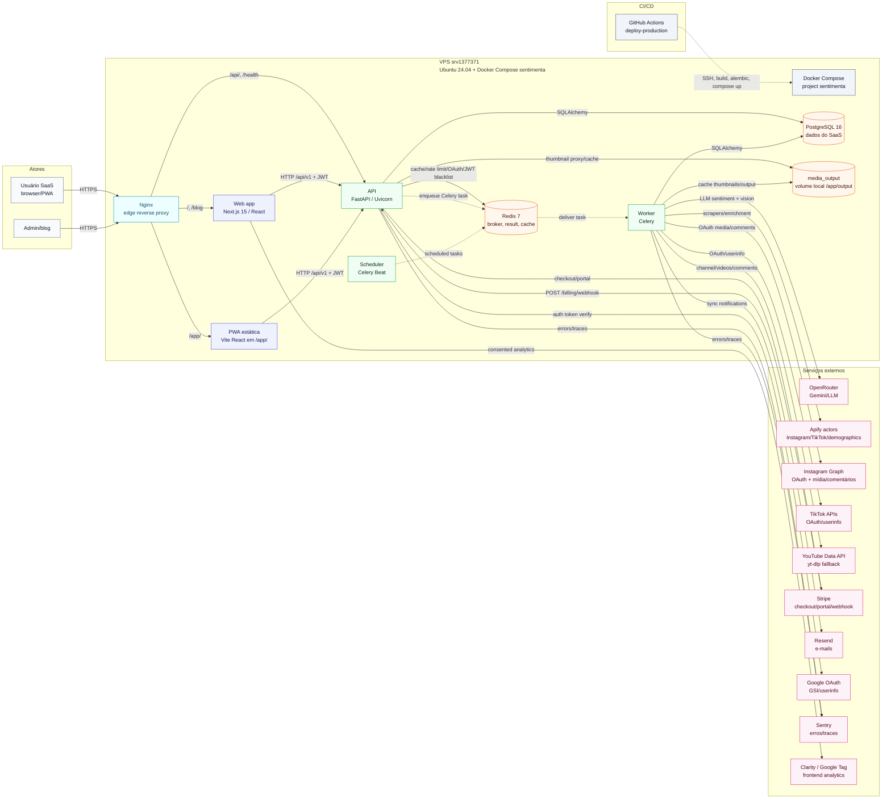
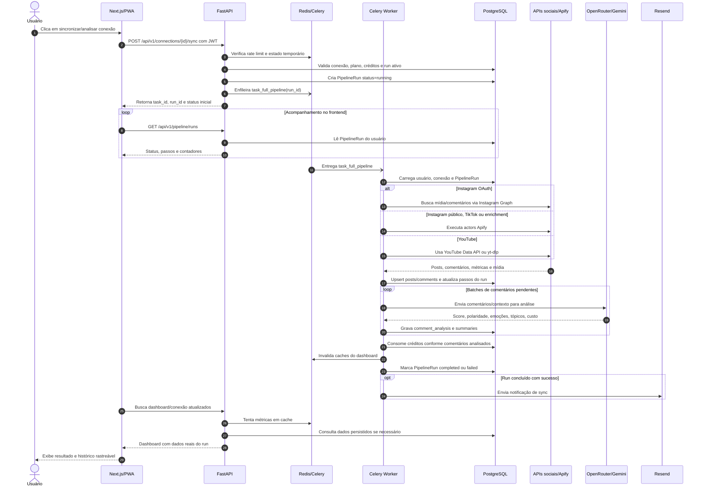
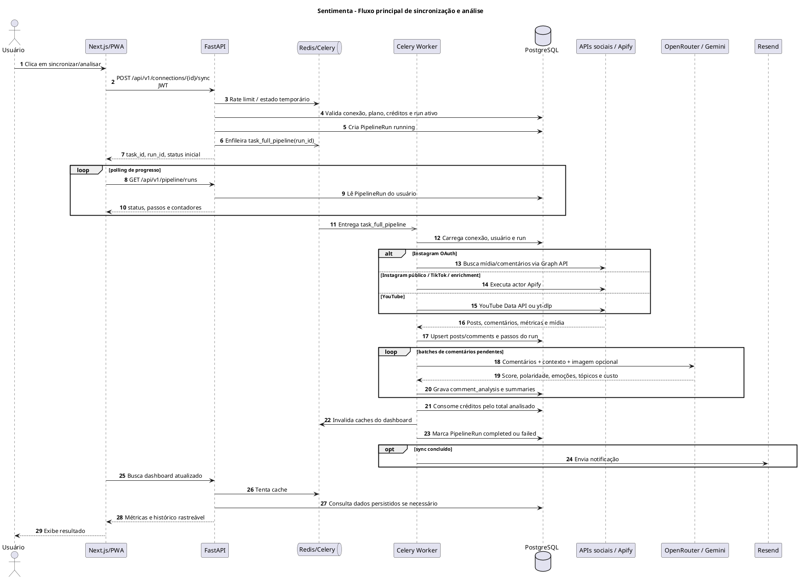

# Arquitetura atual do Sentimenta

Documento gerado em 2026-06-30 com leitura do repositório local e verificação
read-only da VPS de produção. A skill `c4-model` foi instalada a partir do
GitHub (`cheriftj/c4-model-skill`) e usada como guia para a visão C4 de
Container e para o fluxo dinâmico principal.

## 1. Resumo da arquitetura encontrada

- O Sentimenta é um SaaS de análise de reputação digital com frontend web
  Next.js, PWA Vite/React servida estaticamente, backend FastAPI, workers Celery,
  Redis e PostgreSQL.
- O deploy de produção confirmado roda em uma única VPS (`srv1377371`, Ubuntu
  24.04.4) via Docker Compose, projeto `sentimenta`, commit `4ce5a06`.
- O Nginx fica na borda da VPS e encaminha `/api/` e `/health` para a API local
  em `127.0.0.1:8000`, `/` para o Next.js em `127.0.0.1:3000`, e `/app/` para a
  PWA estática em `/opt/sentimenta/apps/mobile/dist/`.
- O backend FastAPI expõe routers de autenticação, conexões sociais, posts,
  dashboard, pipeline, comentários, billing, suporte, demographics, leads e blog.
- O pipeline principal é assíncrono: a API cria um `PipelineRun`, publica tarefa
  Celery no Redis, o worker ingere posts/comentários, chama provedores externos,
  roda análise LLM, persiste resultados e atualiza o status consultado pelo
  frontend.
- O Redis é usado como broker/result backend do Celery e também aparece no código
  como cache, rate limit, blacklist de JWT e estado temporário de OAuth.
- O PostgreSQL é a persistência principal, com modelos SQLAlchemy e migrações
  Alembic para usuários, conexões sociais, posts, comentários, análises, runs,
  créditos, Stripe events, demographics e blog.
- Há volume local `media_output` montado em `/app/output` para cache/saída de
  mídia, incluindo cache de thumbnails.
- Integrações externas confirmadas no código: OpenRouter/Gemini, Apify,
  Instagram Graph/OAuth, TikTok OAuth/API, YouTube Data API e `yt-dlp`, Stripe,
  Resend, Google OAuth, Sentry, Microsoft Clarity/Google Tag no frontend.
- CI/CD confirmado por GitHub Actions: workflow de produção faz SSH na VPS,
  aplica o commit alvo, executa build, `alembic upgrade head` e `docker compose
  up -d`.

## 2. Evidências e premissas

### Confirmado no código e configs

- Backend FastAPI: `backend/app/main.py` inclui routers e endpoint `/health`.
- Dependências backend: `backend/requirements.txt` inclui FastAPI, SQLAlchemy,
  PostgreSQL driver, Celery Redis, Redis, Stripe, Resend, Apify client,
  `sentry-sdk`, `yt-dlp`, `httpx`, `requests` e criptografia.
- Configuração runtime: `backend/app/core/config.py` define `DATABASE_URL`,
  `REDIS_URL`, `CELERY_BROKER_URL`, `OPENROUTER_API_KEY`, `LLM_BASE_URL`,
  `APIFY_API_TOKEN`, OAuth Instagram/TikTok/Google, Stripe, Resend, YouTube,
  PostHog e Sentry.
- Segurança/autenticação: `backend/app/core/security.py` usa bcrypt, JWT,
  Redis blacklist e Fernet para criptografar tokens sociais.
- Celery/cron: `backend/app/tasks/celery_app.py` configura broker/result no
  Redis e agenda refresh de tokens, snapshots de seguidores e syncs diário/semanal.
- Pipeline: `backend/app/routers/connections.py` cria `PipelineRun` e enfileira
  `task_full_pipeline`/`task_analyze_connection`; `backend/app/tasks/pipeline_tasks.py`
  executa ingestão, análise, créditos, cache invalidation e e-mail de conclusão.
- Status em tempo real/polling: `backend/app/routers/pipeline.py` tem endpoints
  de runs/status/SSE; `frontend/components/SyncButton.tsx` usa polling como
  fallback efetivo.
- Persistência: modelos em `backend/app/models/*` incluem `users`,
  `social_connections`, `posts`, `comments`, `comment_analysis`,
  `post_analysis_summary`, `pipeline_runs`, `credit_*`, `stripe_events`,
  demographics e blog.
- Deploy local/prod: `compose.prod.yml` define `postgres`, `redis`, `api`,
  `worker`, `beat` e `web`; API e web são publicados somente em `127.0.0.1`.
- Nginx: `nginx_sentimenta.conf` e `nginx -T` na VPS confirmam proxy para API,
  web e PWA estática.
- Produção read-only: `docker compose ps` na VPS confirmou `api`, `web`,
  `postgres` e `redis` healthy; `worker` e `beat` running sem healthcheck.
- Produção read-only: `/health` da API e do web retornaram `{"status":"ok"}`.
- Produção read-only: `.env` foi lido apenas por nomes de chaves mascarados,
  confirmando presença de variáveis para OpenRouter/Gemini, Apify, Stripe,
  Resend, Google Tag, Instagram, TikTok, YouTube, Redis e Postgres.

### Inferido com alta confiança

- A fronteira de deploy atual é uma VPS única com Nginx + Docker Compose; não há
  evidência de Kubernetes, ECS, Terraform ou múltiplos hosts no runtime atual.
- A PWA mobile não é container em produção; ela é artefato estático servido pelo
  Nginx em `/app/`.
- O frontend web usa API same-origin em `/api/v1` no navegador, enquanto o
  container Next.js também tem `API_URL=http://api:8000` para chamadas server-side.
- Redis acumula papéis operacionais: fila Celery, backend de resultado, cache,
  rate limit, estado OAuth e blacklist de tokens.
- As variáveis `SUPABASE_*` existem na VPS, mas não há uso runtime encontrado no
  código atual; parecem resíduo/legado e não foram modeladas como dependência.
- PostHog tem configuração e código (`backend/app/core/analytics.py`), mas a
  dependência `posthog` não aparece em `backend/requirements.txt`; por isso foi
  tratado como integração não confirmada em runtime.
- Há código de Twitter/Apify, mas o pipeline atual marca Twitter como desabilitado
  na ingestão; não foi desenhado como fluxo principal ativo.

### Não encontrado / pendências de validação

- Não foi encontrada evidência runtime de S3/R2/GCS, buckets externos, NoSQL,
  Kafka, RabbitMQ, SQS, WhatsApp/Twilio, Kubernetes, Helm ou Terraform.
- Não foram coletadas contagens de tabelas em produção para evitar risco de
  exposição/quoting de variáveis sensíveis via SSH; isso não altera os diagramas.
- Certificados TLS, rotação de logs e destino externo de backups não foram
  auditados em profundidade nesta leitura.
- O host de produção roda também projetos não relacionados (`agent`, `chatwoot`,
  `evolution`, `nutri_evolution`); eles não fazem parte da arquitetura do
  Sentimenta, mas afetam isolamento operacional da VPS.

## 3. Diagrama de arquitetura - Mermaid



## 4. Diagrama de fluxo principal - Mermaid

Fluxo escolhido: sincronização/análise de uma conexão social. É o fluxo mais
central do produto porque conecta a promessa principal do SaaS: ingerir dados
reais, analisá-los com LLM, persistir evidências e retornar métricas rastreáveis
ao dashboard.



## 5. Diagrama de arquitetura - PlantUML

```plantuml
@startuml
!include https://raw.githubusercontent.com/plantuml-stdlib/C4-PlantUML/master/C4_Container.puml

LAYOUT_LEFT_RIGHT()
title Sentimenta - Arquitetura atual C4 Container

Person(user, "Usuário SaaS", "Usa dashboard web ou PWA")
Person(admin, "Admin", "Administra blog/configurações")

System_Ext(github, "GitHub Actions", "CI/CD deploy-production")
System_Ext(openrouter, "OpenRouter", "API OpenAI-compatible para Gemini/LLM")
System_Ext(apify, "Apify", "Actors para Instagram/TikTok/demographics")
System_Ext(instagram, "Instagram Graph", "OAuth, mídia e comentários")
System_Ext(tiktok, "TikTok APIs", "OAuth e userinfo")
System_Ext(youtube, "YouTube Data API", "Canais, vídeos e comentários; yt-dlp fallback")
System_Ext(stripe, "Stripe", "Checkout, portal e webhooks")
System_Ext(resend, "Resend", "E-mails transacionais")
System_Ext(google, "Google OAuth", "GSI/userinfo")
System_Ext(sentry, "Sentry", "Erros e traces")
System_Ext(analytics, "Clarity / Google Tag", "Analytics do frontend com consentimento")

System_Boundary(sentimenta, "Sentimenta SaaS - produção") {
  Container_Boundary(vps, "VPS srv1377371 - Ubuntu 24.04 + Docker Compose") {
    Container(compose_runtime, "Docker Compose project", "compose.prod.yml", "Define api, web, worker, beat, postgres, redis e volumes")
    Container(nginx, "Nginx", "Reverse proxy", "Rotas /, /app, /api e /health")
    Container(web, "Web app", "Next.js 15 / React", "Dashboard, blog e UI SaaS")
    Container(mobile, "PWA estática", "Vite React", "Build servido em /app/")
    Container(api, "API", "FastAPI / Uvicorn", "Auth, conexões, pipeline, billing, dashboard")
    Container(worker, "Worker", "Celery", "Ingestão, análise LLM, credits e notificações")
    Container(beat, "Scheduler", "Celery Beat", "Syncs agendados, refresh de tokens e snapshots")
    ContainerDb(postgres, "PostgreSQL 16", "SQL", "Dados do produto e auditoria do pipeline")
    ContainerDb(redis, "Redis 7", "Redis", "Celery broker/result, cache, rate limit, OAuth state e JWT blacklist")
    ContainerDb(media, "media_output", "Docker volume", "Cache local de thumbnails e saída de mídia")
  }
}

Rel(user, nginx, "Acessa", "HTTPS")
Rel(admin, nginx, "Acessa", "HTTPS")
Rel(nginx, web, "Serve / e /blog", "HTTP local 127.0.0.1:3000")
Rel(nginx, mobile, "Serve /app/", "Arquivos estáticos")
Rel(nginx, api, "Proxy /api e /health", "HTTP local 127.0.0.1:8000")
Rel(web, api, "Chama API", "HTTP /api/v1 + JWT")
Rel(mobile, api, "Chama API", "HTTP /api/v1 + JWT")

Rel(api, postgres, "Lê/escreve dados", "SQLAlchemy")
Rel(worker, postgres, "Lê/escreve ingestão, análises e runs", "SQLAlchemy")
Rel(api, redis, "Cache, rate limit, OAuth state, blacklist e enqueue", "Redis/Celery")
Rel(worker, redis, "Consome tasks e resultados", "Celery")
Rel(beat, redis, "Agenda tasks recorrentes", "Celery Beat")
Rel(api, media, "Proxy/cache de thumbnails", "FileResponse")
Rel(worker, media, "Grava cache/saídas", "/app/output")

Rel(api, google, "Verifica login Google", "HTTPS")
Rel(api, stripe, "Checkout e portal", "HTTPS")
Rel(stripe, api, "Webhook billing", "HTTPS POST /billing/webhook")
Rel(worker, openrouter, "Analisa comentários e imagens", "HTTPS")
Rel(worker, apify, "Scraping/enrichment", "HTTPS")
Rel(worker, instagram, "OAuth, mídia e comentários", "HTTPS")
Rel(worker, tiktok, "OAuth/userinfo", "HTTPS")
Rel(worker, youtube, "Dados de canais/vídeos", "HTTPS")
Rel(worker, resend, "Notificações de sync", "HTTPS")
Rel(api, sentry, "Erros/traces", "SDK")
Rel(worker, sentry, "Erros/traces Celery", "SDK")
Rel(web, analytics, "Eventos de frontend", "JavaScript")
Rel(github, compose_runtime, "Deploy via SSH, build, Alembic e compose up", "GitHub Actions")

SHOW_LEGEND()
@enduml
```

## 6. Diagrama de fluxo principal - PlantUML



## 7. Ajustes recomendados

- Adicionar healthcheck explícito para `worker` e `beat`. Na VPS eles aparecem
  como `running`, mas sem status `healthy`, o que reduz visibilidade operacional.
- Investigar swap quase cheio na VPS: leitura read-only mostrou cerca de 1.9 GiB
  usados de 2.0 GiB. Isso pode afetar latência de worker/API em picos.
- Reavaliar isolamento da VPS. O host executa outros projetos Docker não
  relacionados; há risco de contenção de CPU/memória/disco.
- Corrigir a estratégia de progresso em tempo real. Existe endpoint SSE, mas o
  frontend usa polling como fallback efetivo; padronizar uma abordagem reduziria
  complexidade.
- Revisar PostHog: há config/código, mas a dependência não foi encontrada em
  `requirements.txt`. Confirmar se deve ser removido, instalado ou mantido como
  integração futura.
- Atualizar documentação antiga que ainda descreve versões/integrações divergentes
  da arquitetura atual, especialmente onde fala de Gemini direto, Supabase ou
  deploys cloud futuros.
- Formalizar o papel das variáveis `SUPABASE_*` na VPS. Como não há uso runtime
  encontrado, elas deveriam ser removidas ou documentadas como legado.
