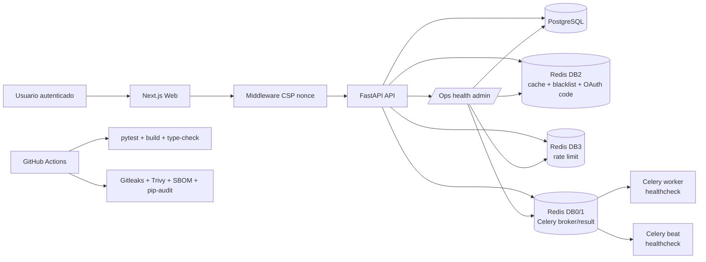
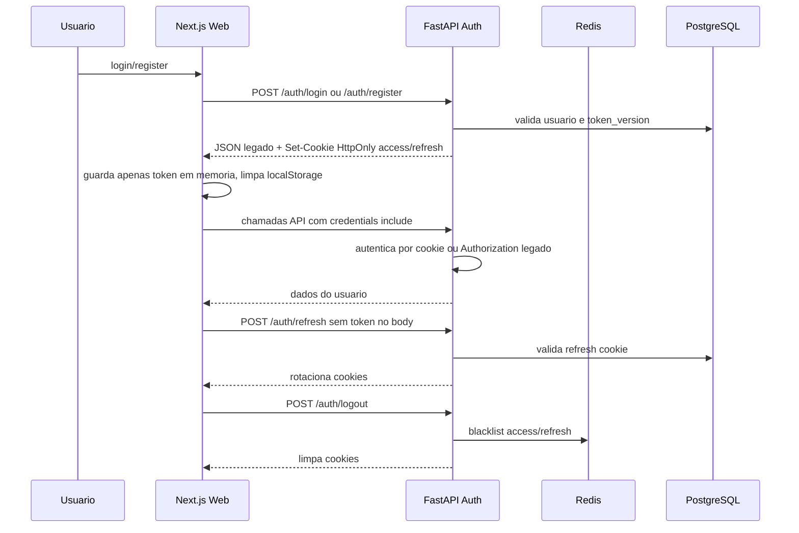
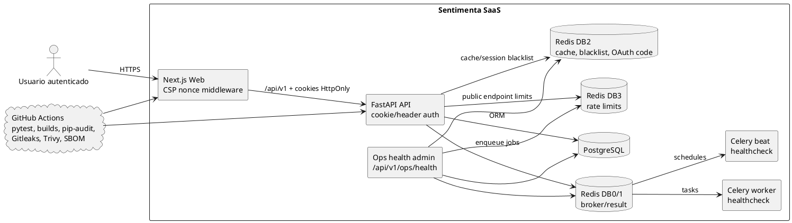
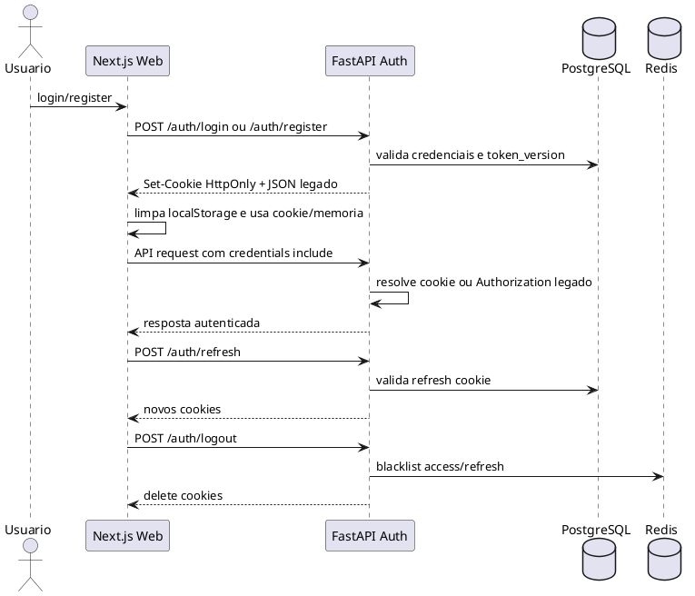

# Hardening implementado - Sentimenta

Data: 2026-07-01

Este documento registra os ajustes implementados a partir da auditoria de seguranca e arquitetura. O foco foi reduzir risco sem quebrar o produto: healthchecks/observabilidade, CSP com nonce, cookies HttpOnly, rate limits, hardening de Compose, CI de seguranca, testes de isolamento multi-tenant e documentacao atualizada.

## Status por pedido

| Pedido | Status | Como foi tratado |
|---|---|---|
| Worker e beat sem healthcheck | Implementado | `compose.prod.yml` ganhou healthchecks para worker/beat usando `python -m app.ops.healthchecks`; API passou a ter `/health/ready`. |
| Observabilidade assincrona parcial | Implementado fase 1 | Novo endpoint admin `/api/v1/ops/health` mostra Redis, Celery, fila, workers e runs stale/failed/partial. |
| CSP Report-Only permissiva | Implementado | CSP dinamica no `frontend/middleware.ts`; em producao usa enforcement com nonce por request e sem `unsafe-eval`. |
| Tokens em localStorage | Implementado fase 1 | Backend seta cookies HttpOnly/Secure/SameSite; web e PWA usam cookie com fallback legado em memoria/localStorage antigo. |
| Hardening Docker | Implementado fase 1 | API/worker/beat/web com `no-new-privileges`, `cap_drop: ALL`, limites de CPU/memoria/PIDs; API/worker/beat com `read_only` e tmpfs. |
| Supply chain JS | Implementado parcialmente | `next-auth` removido; lockfile duplicado do frontend removido; `npm audit fix` aplicado sem breaking changes; restam 2 moderadas Next/PostCSS. |
| Auditoria Python no CI | Implementado | CI instala e roda `pip-audit -r backend/requirements.txt`. |
| Leads anti-spam | Implementado | `/leads/diagnostic` com rate limit por IP e email. |
| Thumbnail proxy abuso | Implementado | `/posts/thumbnail` com rate limit por IP e alvo hash/post_id. |
| Redis centralizado | Implementado fase 1 | Config passou a aceitar `CACHE_REDIS_URL` e `RATE_LIMIT_REDIS_URL`; Compose separa DBs Redis por funcao. |
| CI/CD seguranca/SBOM | Implementado | Job `security` com Gitleaks, Trivy high/critical e SBOM CycloneDX. |
| Multi-tenancy/IDOR | Implementado fase 1 | Nova suite `test_multi_tenant_isolation.py` cobre connections, posts, comments, dashboard, pipeline e billing/credits. |
| Tokens reset/verificacao em claro | Implementado | Tokens novos sao `secrets.token_urlsafe` + HMAC-SHA256; fallback temporario aceita tokens legados ate expirarem. |
| Documentacao drift | Implementado | README atualizado; este relatorio e HTML de hardening criados. |

## Checks executados

| Check | Resultado |
|---|---|
| `python -m compileall backend\app` | Passou |
| `.venv\Scripts\python.exe -m pytest -q backend\tests` | Passou: 71 testes |
| `npm run build:packages` | Passou |
| `npm run type-check` | Passou |
| `npm run build:web` | Passou |
| `npm run build --workspace=@sentimenta/mobile --if-present` | Passou |
| `npm run audit:prod` | Passou no gate high/critical; restam 2 moderadas Next/PostCSS |
| YAML parse de `compose.prod.yml`, CI e Dependabot | Passou |
| `docker compose -f compose.prod.yml config --quiet` | Passou com Docker Compose standalone v5.2.0 em diretorio temporario sem usar `.env` real |

## Diagrama de arquitetura das atualizacoes - Mermaid

## Fluxo de login endurecido - Mermaid

## Diagrama de arquitetura das atualizacoes - PlantUML

## Fluxo de login endurecido - PlantUML

## Melhorias que ficam para a proxima etapa

- Remover `unsafe-inline` de `style-src` exige reduzir estilos inline no frontend.
- Remover fallback legado de bearer/localStorage depois que as sessoes antigas expirarem e os clientes estiverem atualizados.
- Separar Redis em instancias fisicas/servicos gerenciados ainda e melhor que apenas DBs separados.
- Validar Trivy/Gitleaks/SBOM no GitHub Actions em PR/push; o Compose ja validou localmente com binario standalone.
- Fazer deploy assistido em janela controlada e observar `/api/v1/ops/health`, Sentry e logs do worker/beat.
